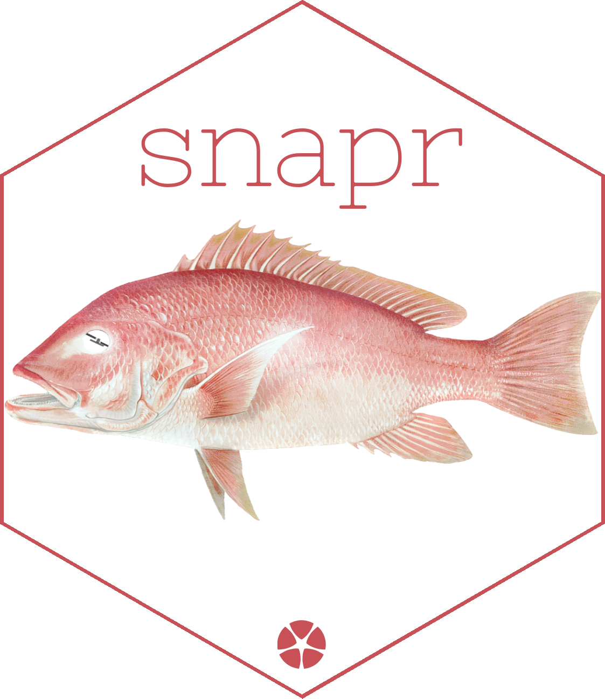

<!-- README.md is generated from README.Rmd. Please edit that file -->

```{r, include = FALSE}
knitr::opts_chunk$set(
  collapse = TRUE,
  comment = "#>",
  fig.path = "man/figures/README-",
  out.width = "100%"
)
```

# snapr



<!-- badges: start -->
[](https://lifecycle.r-lib.org/articles/stages.html#experimental)
<!-- badges: end -->

The goal of snapr is to ...

## Installation


You can install the development version of snapr like so:

``` r
#install.packages("pak")
pak::pkg_install("Permian-Global-Research/snapr")
```

## Example

This is a basic example which shows you how to solve a common problem:

```{r example}
library(snapr)
## basic example code
```

