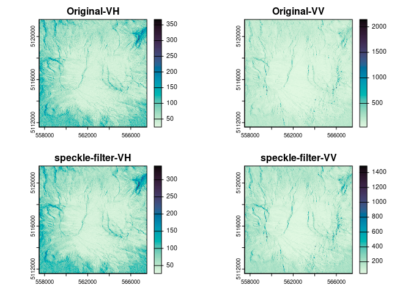
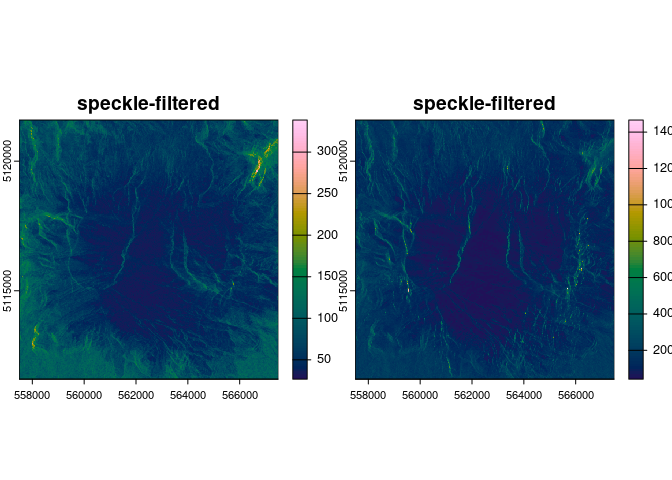

<!-- README.md is generated from README.Rmd. Please edit that file -->

# snapr


<!-- badges: start -->

[](https://lifecycle.r-lib.org/articles/stages.html#experimental)
<!-- badges: end --> snapr is a proof of concept R package to interact
with [The ESA Sentinel Applications Platform
(SNAP)](https://step.esa.int/main/toolboxes/snap/) from R. SNAP provides
an impressive set of tools for processing satellite data, many of which
are not available in the wider R ecosystem. snapr is a wrapper for
SNAP’s Graph Processing Tool (command line interface) and shares
similar ambitions to the
[SNAPISTA](https://github.com/snap-contrib/snapista) python library.

## Installation

You can install the development version of snapr like so:

``` r
#install.packages("pak")
pak::pkg_install("Permian-Global-Research/snapr")
library(snapr)
install_snap()

# This is only needed for pacakge development but also if you want access to the 
# snappy python library with {reticulate} for example.
# configure_snappy_python() 

```

## Example

This is a basic example which shows you how to solve a common problem:

``` r
library(snapr)
library(terra)
#> terra 1.7.71

mt_st_helens_s1 <- system.file("s1/mt_st_helens_s1.tif", package = "snapr")

out_file <- tempfile(fileext = ".tif")

sg <- snap_graph(
  op_read(
    operator_id = "Reader",
    file = mt_st_helens_s1
  ),
  op_speckle_filter(
    operator_id = "SpeckleFilter",
    sourceProduct = "Reader",
    filter = "Refined Lee"
  ),
  op_write(
    operator_id = "Writer",
    sourceProduct = "SpeckleFilter",
    file = out_file,
    formatName = "GeoTIFF"
  )
)
show_xml(sg)
#> XML process graph: 
#> 
#> <?xml version="1.0" encoding="UTF-8"?>
#> <graph>
#>   <version>1.0</version>
#>   <node id="Reader">
#>     <operator>Read</operator>
#>     <sources/>
#>     <parameters>
#>       <file>/tmp/Rtmpa7Yq0I/temp_libpath18d5df6221ad/snapr/s1/mt_st_helens_s1.tif</file>
#>       <formatName/>
#>       <pixelRegion/>
#>       <geometryRegion/>
#>       <copyMetadata>true</copyMetadata>
#>       <sourceBands/>
#>       <sourceMasks/>
#>     </parameters>
#>   </node>
#>   <node id="SpeckleFilter">
#>     <operator>Speckle-Filter</operator>
#>     <sources>
#>       <sourceProduct refid="Reader"/>
#>     </sources>
#>     <parameters>
#>       <sourceBands/>
#>       <filter>Refined Lee</filter>
#>       <filterSizeX>3</filterSizeX>
#>       <filterSizeY>3</filterSizeY>
#>       <dampingFactor>2</dampingFactor>
#>       <estimateENL>false</estimateENL>
#>       <enl>1</enl>
#>       <numLooksStr>1</numLooksStr>
#>       <windowSize>7x7</windowSize>
#>       <targetWindowSizeStr>3x3</targetWindowSizeStr>
#>       <sigmaStr>0.9</sigmaStr>
#>       <anSize>50</anSize>
#>     </parameters>
#>   </node>
#>   <node id="Writer">
#>     <operator>Write</operator>
#>     <sources>
#>       <sourceProduct refid="SpeckleFilter"/>
#>     </sources>
#>     <parameters>
#>       <file>/tmp/RtmpqoMqUj/file199cc50ef9a43.tif</file>
#>       <formatName>GeoTIFF</formatName>
#>       <deleteOutputOnFailure>true</deleteOutputOnFailure>
#>       <writeEntireTileRows>false</writeEntireTileRows>
#>       <clearCacheAfterRowWrite>false</clearCacheAfterRowWrite>
#>     </parameters>
#>   </node>
#> </graph>

suppressMessages(run_graph(sg))

plot(rast(mt_st_helens_s1), main = "Original-GRD", col = hcl.colors(100, "batlow"))
```



``` r
plot(rast(out_file), main = "speckle-filtered", col = hcl.colors(100, "batlow"))
```


